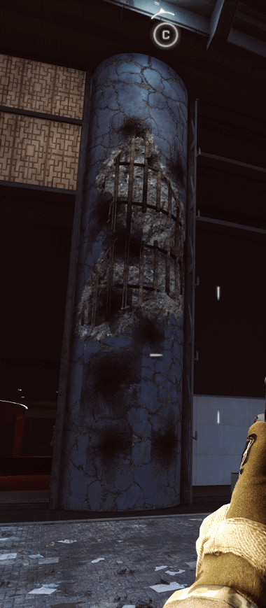

# Low level modifications for BF4 server

### Features:
* Undestructible tower pillars on Shanghai map, which is impossible to do with any legal plugins.\
Changes 1250 HP of each pillar to 10^21 HP by direcly substituting values in memory
* Attack helis don't spawn until a certain amount of players on the server *
* Autokill for using enemy attack heli *

(*) means that the feature relies on someone elses code which I don't want to publish\
The full toolset was used on TDS servers (2017-2019 RIP)

### Requrements:
* Battlefield 4 server build 179665/R63
* Access to the server proccess since you have to inject a dll
* Visual Studio

### DLL Injection

### The pillar isn't destroyed after multiple hits

